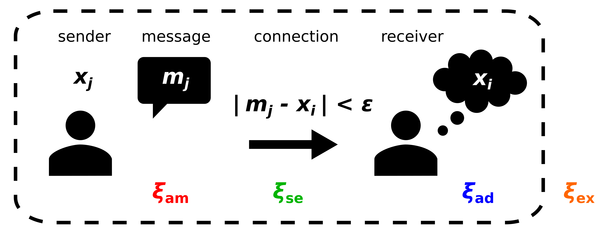

# Noise and Opinion Dynamics

## The model 
We investigate here the impact of four different types of noise on the bounded confidence (BC) model of opinion formation. Without noise, the BC model for an interaction of a receiving agent $i$ and a sending agent $j$ with opinions $x_i$ and $x_j$ reads:

$$
	x_{i} \mapsto 
        \begin{cases} 
            x_i + \mu \cdot (m_j -  x_{i}) & \text{if } \left| m_j - x_{i} \right| < \epsilon \\
            x_i & \text{else}
        \end{cases} \ \  \text{with the message } m_j = x_{j} 
$$
with the bounded confidence radius $\epsilon$ and the message $m_j$.


<p align="center">
  
</p>


The four types of noise include:

### Selection noise $\xi_{\rm se}$

$$
	x_{i} \mapsto 
        \begin{cases} 
            x_i + \mu \cdot (m_j -  x_{i}) & \text{if } \left| m_j - x_{i} \right| < \epsilon + \xi_{\rm se} \\
            x_i & \text{else}
        \end{cases} \ \  \text{with the message } m_j = x_{j} 
$$

### Adaptation noise $\xi_{\rm ad}$

$$
	x_{i} \mapsto 
        \begin{cases} 
            x_i + \mu \cdot (m_j -  x_{i})  + \xi_{\rm ad} & \text{if } \left| m_j - x_{i} \right| < \epsilon \\
            x_i & \text{else}
        \end{cases} \ \  \text{with the message } m_j = x_{j} 
$$

### Exogenous noise $\xi_{\rm ex}$

$$
	x_{i} \mapsto 
        {\rm BC \ model} + \xi_{\rm ex} \ {\rm with \ some \ probability }\omega
$$

### Ambiguity noise $\xi_{\rm am}$

$$
	x_{i} \mapsto 
        \begin{cases} 
            x_i + \mu \cdot (m_j -  x_{i}) & \text{if } \left| m_j - x_{i} \right| < \epsilon \\
            x_i & \text{else}
        \end{cases} \ \  \text{with the message } m_j = x_{j}  + \xi_{\rm am}
$$

Noise is drawn from a zero-mean Gaussian distribution with Gaussian width $\nu$. Noise is truncated such that the opinion $x_i$ or the message $m_j$ is within the bounds of the opinion space $\[0, 1\]$. Note, for exogenous noise, we choose $\nu=\omega$. 

## Running simulations

The simulation can simply be run by executing the ```python model.py```. Parameters that can be changed to reproduce the results of the manuscript should be changed in the lines below ```# CHOOSE PARAMETERS``` (l. 312)

## Test

To analyse the model, the following code should produce a very simplified version of figure 2a in the manuscript.

1. Run the model for ambiguity noise and several seeds.
2. Run the analysis (e.g. in a Jupyter notebook)

```
import xarray as xr
import matplotlib.pyplot as plt
import numpy as np

eps_vals = [0.001] + list(np.arange(0.05, 0.41, 0.05))  # TODO the BC radius values (here for low resolution) 
seedmax=9  # TODO depending on how many seeds were chosen
data = xr.merge([ xr.open_dataset(f"data/model-ambiguityNoise_lowRes_time_2G-6AMInitial_eps{eps:.3f}_seeds0-{seedmax}.ncdf", engine="netcdf4") for eps in eps_vals])
   
data.std(dim="id").sel({"t":1e4, "mu":0.5}).mean(dim="seed").x.plot(x="nu",cmap="Reds")
plt.ylim(0.4,0)
```

| Parameter  | Description | Example Value |
|-----|-----|------|
| track_times | List of times at which a snapshot of the simulation should be saved; must include 0 (initial time) and the final time | \[0,10e5\] |
| mu_arr | List of the $\mu$ to be run | \[0.5\]| 
| n | Number of agents | 100 |
| seeds | List of the seeds to be run | list(range(1000)) |
| resolution | The resolution of the phase space of bias and noise levels (eps, nu) | "low" or "high" |
| ic | the description of the initial conditions to be used. We tested more options, but these are commented out to increase clarity  | "uniform" or "2G-6AM" (which means a superposition of two Gaussian functions to represent climate change opinions in the society according to the six America data, see [Maibach et al. (2011)]) |
| noise_type | the type of noise in the opinion formation process (see above)| "ambiguityNoise" | 


## Relevant Python Libraries and Dependencies 

| Package  | Version |
|-----|-----|
| python | 3.9.5 |
| scipy | 1.6.2 |
| numpy | 1.20.2 |
